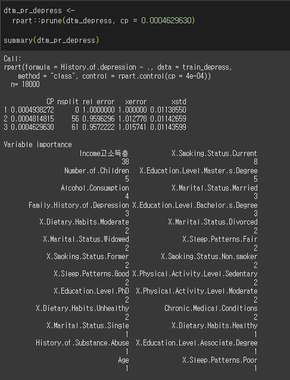

# 🧠 개인 특성 기반 우울증 예측 모델링 (R)

## 🎯 프로젝트 개요

- 다양한 개인 특성(나이, 음주, 식습관, 수면 패턴 등)을 바탕으로 **우울증 경험 여부(History of Depression)** 를 예측하는 분류 모델 구축
- 의료 및 복지 서비스에서 고위험군 사전 식별을 위한 **데이터 기반 접근의 가능성** 제시
- 데이터 전처리부터 모델 성능 비교까지 **R 기반 전체 파이프라인** 구현

---

## 🛠️ 담당 역할

| 이름 | 역할 |
|------|------|
| **정현우** | 데이터 전처리, 모델링 기획 및 구현 |
| **변지민** | 탐색적 데이터 분석, 모델링 기획 및 구현, 모델 평가 |

- `fread` + `dplyr` 기반 전처리 파이프라인 구성
- 나이/소득 범주화, 문자열 인코딩(라벨/원핫), 불균형 조정(SMOTE 아님)
- 시각화: `ggplot2` 기반 변수 분포 및 클래스 비율 시각화

---

## ⚙️ 전체 흐름

1. **데이터 불균형 조정**
   - 우울증 경험 비율: Yes/No 간 불균형 → 70:30 비율로 리샘플링
2. **범주형 변수 변환**
   - 나이 → 청년/중년/노년
   - 소득 → 사분위 기준으로 저소득/중소득/고소득
   - 기타 변수 → 라벨 인코딩 + 원핫 인코딩 혼합 적용
- 변수 분포 시각화

  
  

  

3. **분석용 변수 선택**
   - 공선성 확인 후 다중 공선성 변수 제거 (VIF)
   - 최적 feature subset 구성

---

## 📊 모델링 및 성능 비교

### 1️⃣ 로지스틱 회귀 (Logistic Regression)

로지스틱 회귀는 이진 분류 문제에서 가장 기본적인 선형 모델입니다.  
본 프로젝트에서는 변수 간의 관계를 해석할 수 있다는 장점과, 기준선 성능을 제시한다는 점에서 먼저 적용하였습니다.

- ✅ **다중공선성 제거**: VIF(Variance Inflation Factor)를 활용해 공선성이 높은 변수들을 제거하였습니다.
- ✅ **변수 해석력**: 어떤 요인이 우울증 발생 확률에 영향을 미치는지를 계수값을 통해 해석할 수 있었습니다.
- ✅ **ROC 커브 분석**: AUC를 기준으로 최적 cutoff 값을 선정하여 예측 성능을 향상시켰습니다.

📎 _시각화 자료_
- `ROC Curve 및 AUC`:  

  

  > *AUC를 기반으로 모델의 성능을 평가하고, threshold를 튜닝하여 민감도/특이도 조절*

---

### 2️⃣ 의사결정나무 (Decision Tree - rpart)

의사결정나무는 변수 간의 비선형 관계를 명확히 보여주는 모델로,  
분류 규칙이 직관적으로 표현되고 시각화가 가능하다는 장점이 있습니다.

- ✅ **분류 기준 해석 용이**: 조건부 규칙을 통해 어떤 특성이 주요 분류 기준인지 쉽게 파악할 수 있습니다.
- ✅ **가지치기(pruning)**: xerror 기준 최적 `cp` 값을 찾아 과적합 방지
- ✅ **해석 중심의 시각화**: 복잡한 조건 없이도 결과를 시각적으로 파악 가능

📎 _시각화 자료_
- `의사결정나무 트리 구조`  

  

 
  > *Tree 구조를 통해 우울증 예측 기준을 시각적으로 파악 가능*

---

### 3️⃣ 랜덤 포레스트 (Random Forest)

랜덤 포레스트는 여러 개의 결정트리를 결합한 앙상블 학습 모델로,  
높은 예측 정확도와 변수 중요도 분석에 강점을 가집니다.

- ✅ **높은 정확도**: 다수의 결정트리를 기반으로 하여 과적합을 줄이고 일반화 성능을 향상시킴
- ✅ **변수 중요도 도출**: 어떤 요인이 예측에 영향을 미치는지 `varImpPlot`을 통해 확인 가능
- ✅ **강건한 성능**: 다양한 변수와 샘플에 강건한 결과 제공

📎 _시각화 자료_
- `변수 중요도 시각화`:  

  

  > *랜덤 포레스트에서 주요 변수들을 시각적으로 도출*

- `Confusion Matrix`:  

  

 
  > *랜덤 포레스트 기반 우울증 예측 결과 비교 (정/오분류 결과)*

---

### 📈 모델별 성능 시각화

- 🔹 **로지스틱 회귀**
  - ROC Curve 시각화  
  - Threshold 기준 최적 Cutoff 설정  
  - 📎 _삽입 위치 예시_: `./images/logistic_roc.png`

- 🔹 **의사결정나무**
  - 모델 구조 트리 시각화  
  - 가지치기 전후 비교  
  - 📎 _삽입 위치 예시_: `./images/rpart_tree.png`

- 🔹 **랜덤 포레스트**
  - 변수 중요도 그래프 (`varImpPlot`)  
  - Confusion Matrix 비교  
  - 📎 _삽입 위치 예시_: `./images/rf_importance.png`, `./images/rf_cm.png`

---

> ☑️ 각 모델별로 confusion matrix와 성능 지표(AUC, Accuracy)를 비교하여 최종 모델 선정에 활용하였습니다.

---

## 🧾 주요 성과

- 다양한 전처리/분석 기법을 실습 환경에서 직접 구현
- 라벨링/범주화/샘플링 전략의 성능 영향을 실험적으로 검토
- 모델별 성능/복잡도/해석력 균형을 고려한 평가

---

## 💡 향후 개선 방향

- SMOTE 등 오버샘플링 기반의 고도화된 불균형 처리 적용
- Shiny를 활용한 대시보드 기반 우울증 예측 UI 설계
- 다양한 사회적-환경적 맥락에서 보다 효과적인 정책적 개입 방안 설계 가능

